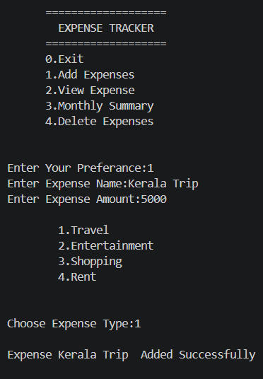
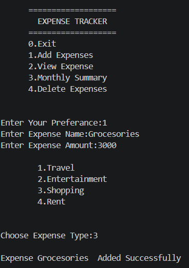
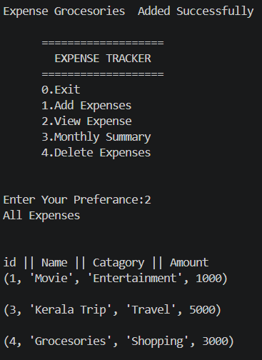
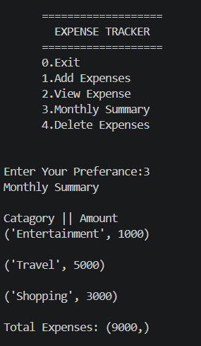
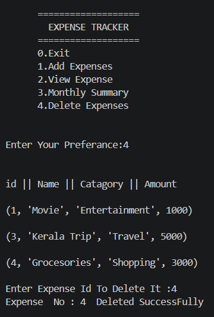
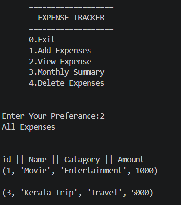
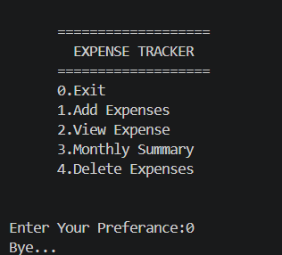

<h2 align="center">Terminal Based Expense Tracker</h2>

<table>
<tr>
<td align="center">
 
<b>Main Menu</b>
</td>

<td align="center">
 
<b>Add Expense</b>
</td>

<td align="center">
 
<b>Expense Added</b>
</td>
</tr>

<tr>
<td align="center">
 
<b>View Expenses</b>
</td>

<td align="center">
 
<b>Monthly Summary</b>
</td>

<td align="center">
 
<b>Delete Expense</b>
</td>
</tr>

<tr>
<td colspan="3" align="center">
 
<b>Exit</b>
</td>
</tr>
</table>